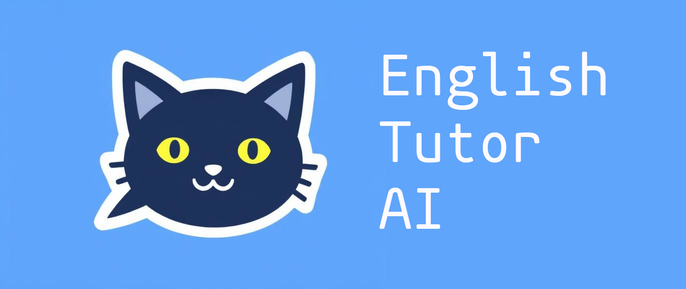

# English Tutor AI



**English Tutor AI** is a lightweight, educational application designed to support the learning and correction of English grammar through an intuitive, web-based interface. It aims to enhance language proficiency in underserved and rural areas by providing immediate feedback on user-submitted sentences and phrases.

---

## 📚 Project Overview

This tool provides users with:

- Real-time analysis and correction of English sentences  
- Spanish-language feedback to support learners in bilingual contexts  
- An accessible and friendly user interface built for low-resource environments  
- Simulated translation and correction capabilities that mimic intelligent behavior

The goal of **English Tutor AI** is to bring digital language support to educational institutions and self-learners who may lack access to formal tutoring services.

---

## 🎯 Use Case

Originally designed with rural Colombian schools in mind, the system allows learners to submit English phrases and receive:

- Improved grammatical constructions  
- Translations to Spanish  
- Constructive suggestions to reinforce learning

Its clean design, cross-platform support, and language accessibility make it ideal for classrooms, libraries, and home use.

---

## 🚀 Running the Application

1. **Clone the repository**:

   ```bash
   git clone https://github.com/yourusername/english-tutor-ai.git
   cd english-tutor-ai
   ```

2. **Create a virtual environment and install dependencies**:

   ```bash
   python3 -m venv venv
   source venv/bin/activate
   pip install -r requirements.txt
   ```

3. **Run the Flask server**:

   ```bash
   python run.py
   ```

4. **Open your browser and go to**:

   ```
   http://127.0.0.1:5000
   ```

---

## 🧪 Testing

Run the included test suite using:

```bash
pytest tests/
```

---

## 📂 Training

The `training/` directory contains the structure for a simplified model training environment. While certain assets are simulated due to repository size limitations, you can explore real datasets suitable for grammar correction at:

- [Kaggle: English Grammar Errors Corpus](https://www.kaggle.com)
- [Cornell Movie Dialogues](https://www.cs.cornell.edu/~cristian/Cornell_Movie-Dialogs_Corpus.html)
- [OpenSubtitles](https://opus.nlpl.eu/OpenSubtitles.php)

These resources may help to explore future expansions or demonstrations of enhanced AI behavior.

---

**English Tutor AI** is more than a tool—it's a step toward democratizing education through intelligent interfaces.

